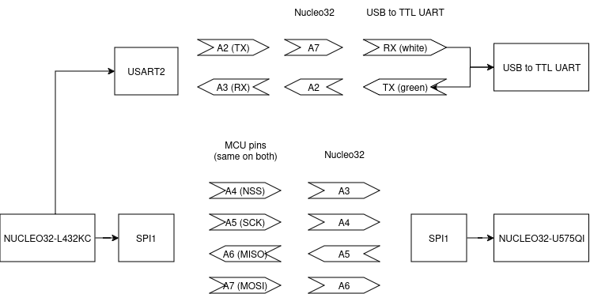

# SPI Echo
Receive a byte over USART2 on the controller and send it over SPI1 to the peripheral. Peripheral echoes it back and controller sends it back over USART2.

Sending data from a peripheral to the controller is difficult because the peripheral device cannot control the SCK line and thus cannot choose when to send data to the controller. This means you need some sort of synchronization mechanism to facilitate communication from the peripheral to the controller, whether this is an extra pin to signal the readiness of the peripheral or some sort of messaging protocol.

Specific-purpose chips like EEPROM and RF chips have dedicated hardware support for efficient SPI communication. They can respond to a data packet coming over MOSI with a data packet in the immediate following clock pulses. This is impossible to achieve with a general-purpose microcontroller.

## Pins

